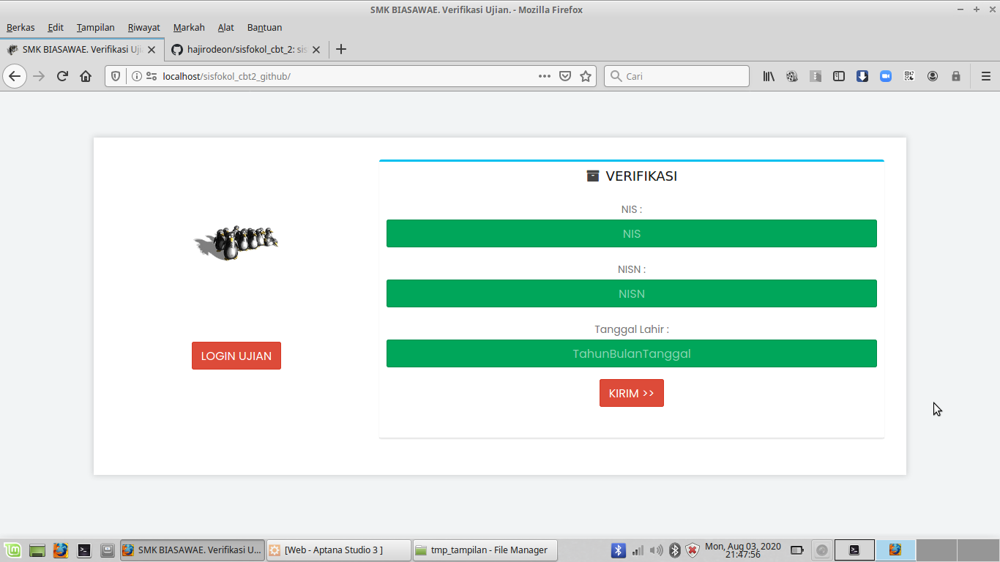
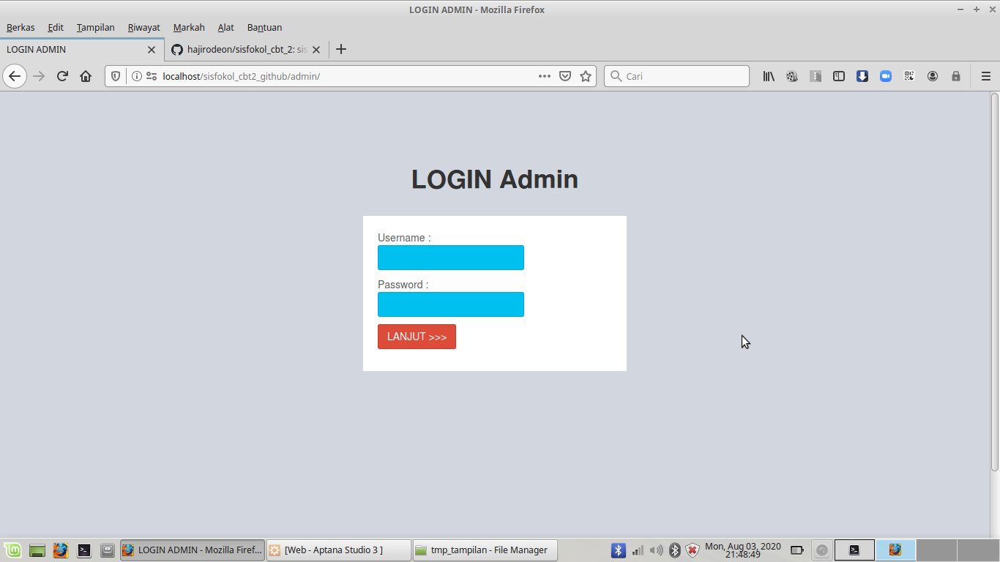
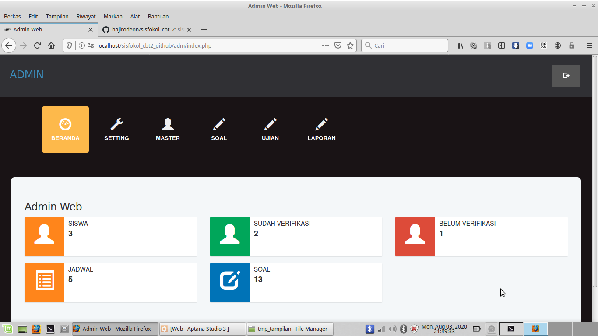
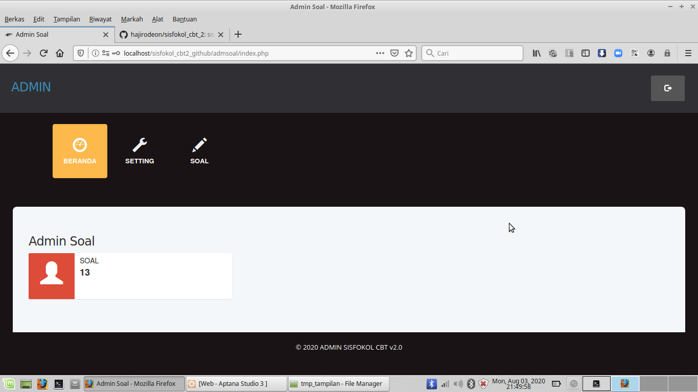
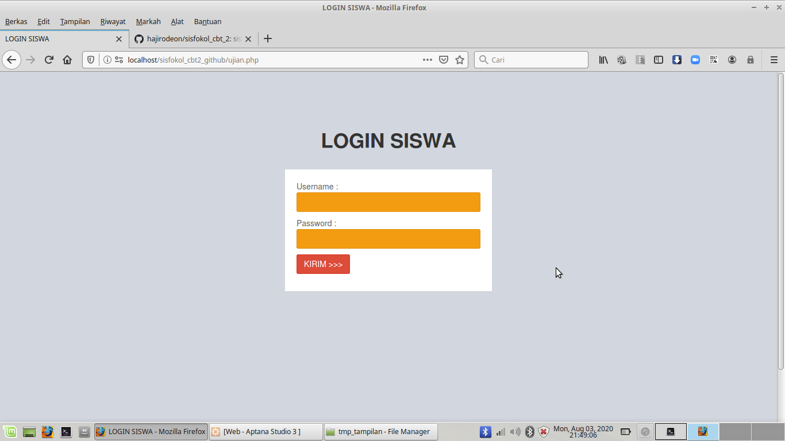
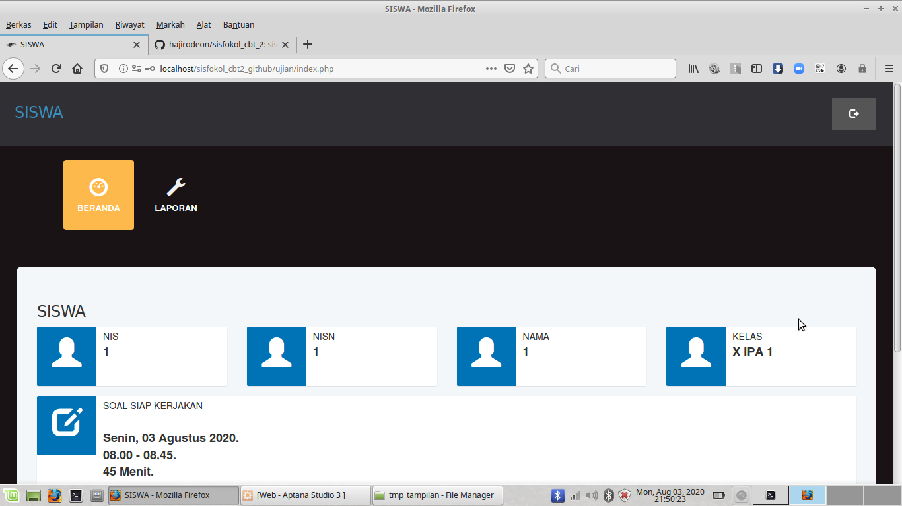

# SISFOKOL CBT v2.0

SISFOKOL CBT v2.0 untuk keperluan Ujian Online Siswa. 

Berjalan optimal dengan Webserver XAMPP Php7.4.8

Konfigurasi ada di file /inc/config.php

File .sql ada di folder /db

---

Terdiri dari Tiga Akses User : Admin, Pembuat Soal, Siswa.

---

AKSES ADMIN 

User : admin

Pass : Sisfokol2020

Alamat Akses : 

http://alamatnya/admin

---

AKSES PEMBUAT SOAL :

User : 1

Pass : 1

Alamat Akses : 

http://alamatnya/admin

---

AKSES SISWA :

User : 1

Pass : 1

Alamat Akses : 

http://alamatnya

---

